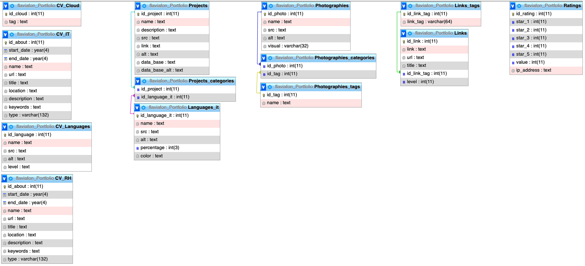

# Portofolio (monthly update)
## Table of Contents

1. [General Info](#general-info)
2. [Stacks](#stacks)
3. [Installation](#installation)
4. [Pages](#pages)
5. [Database](#database)
6. [Use](#use)
7. [TODO](#todo)
8. [FAQs](#faqs)

 

### General Info

---

My personal CV. 

To promote myself.

 

### Stacks

---
Architecture MVC
- [PHP](https://www.php.net/): Version 8.1.6
- [JavaScript]()
- [CSS]()
- [MySQL](https://www.mysql.com/)

Librairy : 
- [PHPMailer](https://github.com/PHPMailer/PHPMailer)

 

### Installation

---
- Need PHP 
- XAMP or equivalent
- MySQL database 

 

### Pages

---
    - header : logo and darkmode button
    - footer : to contact and follow
    - aside : menu

- homepage : aside with menu, photo, menu
- about : CV details and CV.pdf
- link : links useful
- photography : my photographies
- project : project done
- opinion : rate the portfolio
- message : send a message

 

### Database
---

- certifications
- cloud
- IT
- languages IT
- language
- Link
- Photography
- Project
- Rating
- RH
- User
 

### Use

---
When you add the database and active XAMP you can connect via : [index.php](index.php)

- to get to know me better : [Porfolio on line - About](https://flavproject.000webhostapp.com/CVPortfolio/index.php?page=about)

- to run my projects : - to see my photographies : [Porfolio on line - Project](https://flavproject.000webhostapp.com/CVPortfolio/index.php?page=project)

- to see my photographies : [Porfolio on line - Photos](https://flavproject.000webhostapp.com/CVPortfolio/index.php?page=photography)

- to add links on the page : [Porfolio on line - Links](https://flavproject.000webhostapp.com/CVPortfolio/index.php?page=link)

- to send your opinion about my website : [Porfolio on line - Opinion](https://flavproject.000webhostapp.com/CVPortfolio/index.php?page=opinion)

- to send me a message : [Porfolio on line - Message](https://flavproject.000webhostapp.com/CVPortfolio/index.php?page=message)

 

### TODO

---
- [ ] % language
- [ ] alert email when somebody add a link
- [ ] not showing the tag when no links inside the box
- [ ] add logos in menu top homepage ?
- [ ] add links
- [ ] git (add the file hide)
- [ ] get faster (see how to improve it ; Photographies size, code shorter, ...)

 

### FAQs

---

